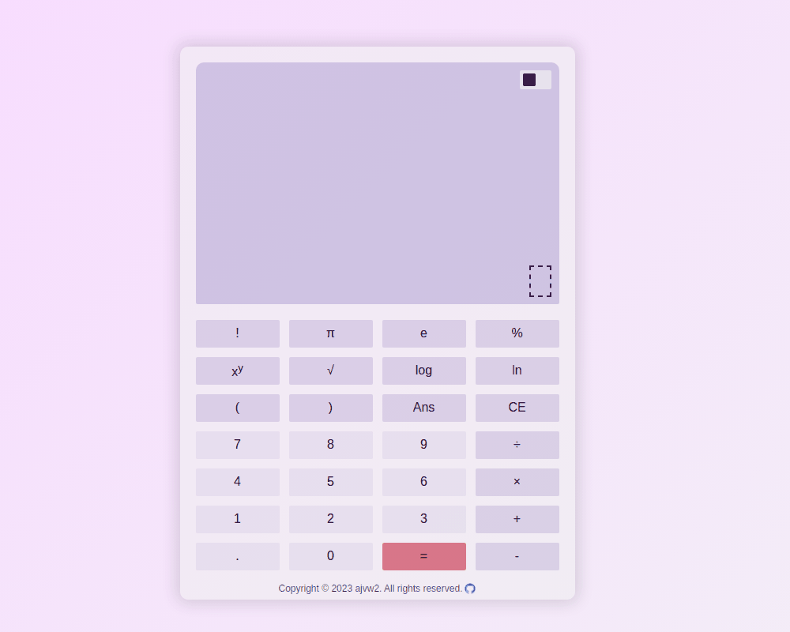

# Sketcher

This is a semi-scientific calculator for browsers. This project is an assignment on The Odin Project (see: [Project Page](https://www.theodinproject.com/lessons/foundations-calculator)).  

Click [here](https://ajvw2.github.io/odin-calculator/) for a live demo.  

## Languages

- HTML/CSS
- JavaScript

## Project Description

#### Features

- Basic arithmetic operations
- Power, square root, log, natural log, factorial and percentage operations
- Some special numbers ($\pi$, e)
- Supports decimal numbers
- Supports multiple operation inputs, e.g. "5 ^ 4 - (3 / (2 * 1))".
- Recall of the previous answer
- Clear/backspace button
- Light/dark mode switch
- Keyboard support (see below)
- Responsive UI

#### Keyboard controls

| Key(s) | Output |
| --- | --- |
| Number keys (including numpad) | 0-9 |
| . | decimal point |
| ! | factorial |
| % | percentage |
| ^ | power |
| s | square root |
| l | log() |
| n | ln() |
| / | division |
| * | multiplication |
| + | addition | 
| - | subtraction |
| = | evaluate expression |
| Enter | evaluate expression |
| ( | opening bracket |
| ) | closing bracket |
| a | previous answer |
| p | $\pi$ |
| e | e |
| Backspace | clear previous input |

#### Commentary

This is the final project of The Odin Project's Foundations Course. The experience gained with the previous projects came in handy, and I found myself satisfied with the design rather quickly. Making a responsive UI for [my Etch-A-Sketch project](https://ajvw2.github.io/odin-etch-a-sketch/) took a lot of effort. With the significantly less complex UI of the calculator, this was a breeze. It was great to notice such progress. I hadn't implemented a light/dark mode switch before, and this project seemed like the perfect place to give that a try. 

The largest challenge this project posed was the implementation of the calculator functionality. I wanted my calculator to do more than just the basic arithmetic operations, and I wanted longer inputs to be possible (like, for example, the Google calculator). 

First, I tried using RegEx, but this proved to be a challenge for the evaluation longer inputs. So, instead of that, I decided to go with an application of Dijkstra's Two-Stack algorithm, which I came across in an algorithms course I am currently following. Every separate input is put on the display screen of the calculator as a separate div, with class "number" or class "operator". These divs are then read and split onto the value and operator stacks (there's a bit more to it, but that's the gist of it). It took some tweaking, but the end result seems to work fine.  

I did some testing, but since the inputs can become as complex as the user wants, there might be some evaluation bugs I didn't anticipate. Feel free to let me know if this is the case.  

#### TODO

- Minor UI bug fixes
- Clean up CSS file

#### Creator

My Github profile: [ajvw2](https://github.com/ajvw2)